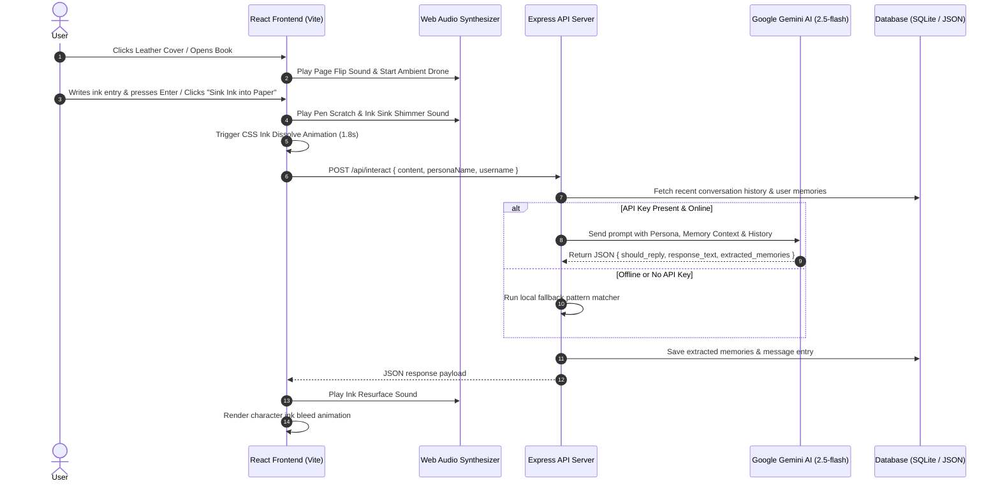
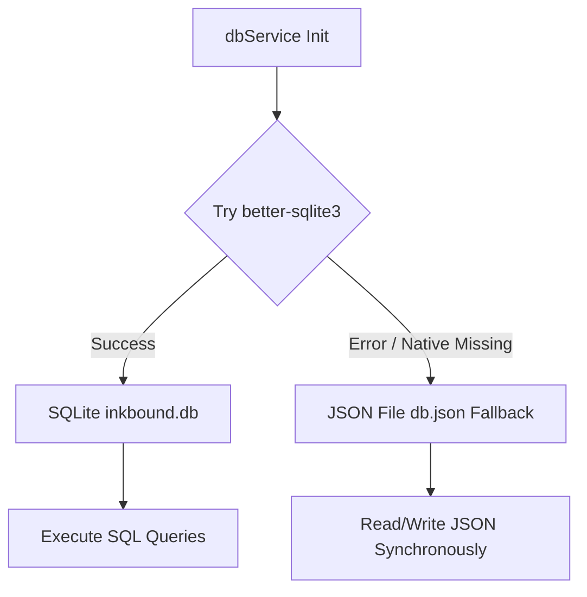

# 📘 Inkbound: Technical Implementation Documentation

This document provides a comprehensive technical breakdown of how **Inkbound** (an interactive web app inspired by Tom's diary from the famous book) was designed, architected, and implemented.

---

## 📑 Table of Contents

1. [Architectural Overview](#1-architectural-overview)
2. [Frontend Implementation](#2-frontend-implementation)
   - [Component Structure](#component-structure)
   - [State & Interaction Lifecycle](#state--interaction-lifecycle)
   - [Ink Bleed & Animation Engine](#ink-bleed--animation-engine)
   - [Procedural Web Audio Engine](#procedural-web-audio-engine)
   - [Design System & CSS Styling](#design-system--css-styling)
3. [Backend Implementation](#3-backend-implementation)
   - [Express REST API Server](#express-rest-api-server)
   - [Gemini AI Engine & Persona Prompting](#gemini-ai-engine--persona-prompting)
   - [Offline Fallback Simulation Engine](#offline-fallback-simulation-engine)
   - [Dual-Tier Data Storage Engine](#dual-tier-data-storage-engine)
4. [API Specifications](#4-api-specifications)
5. [Database Schema & Data Models](#5-database-schema--data-models)
6. [Development & Build Setup](#6-development--build-setup)

---

## 1. Architectural Overview

Inkbound is built using a modern full-stack decoupled architecture. The frontend application renders an interactive 3D leather journal with parchment pages, while the backend API processes user text input using Google Gemini AI, extracts structured memories into a database, and feeds back the diary's response.



---

## 2. Frontend Implementation

The frontend is implemented using **React 19** and **Vite**, structured into modular components:

### Component Structure

- [App.jsx](file:///home/rkbart/Projects/inkbound/src/App.jsx): Root component managing top-level state: book open/closed state (`isOpen`), entries log (`entries`), memories bank (`memories`), modal visibility (`showMemoriesModal`), and backend fetch/sync lifecycle handlers.
- [BookCover.jsx](file:///home/rkbart/Projects/inkbound/src/components/BookCover.jsx): Renders the closed leather-bound book cover featuring embossed typography ("INKBOUND Living Journal"), gold corner plates (`.corner-plate`), center glowing crest, and interactive unlatching book clasp button.
- [ParchmentSpread.jsx](file:///home/rkbart/Projects/inkbound/src/components/ParchmentSpread.jsx): The main interactive two-page spread:
   - **Left Page**: Historical ledger displaying previous user entries and the diary's absorbed replies. Memory ledger is hidden by default and can be toggled with the eye icon button. Houses footer tools for toggling ambient audio, toggling entry visibility, and enabling Horcrux cursed mode. Includes the pullable Ribbon Bookmark to open the Memory Drawer. Entries auto-scroll to the bottom when new ones appear.
   - **Right Page**: Dual-mode page switching between `write` state (full-page ink textarea with Enter key handler) and `response` state (full-page diary resurfacing view). Press Enter or double-click the response to start a new entry.
- [TomRiddleWriter.jsx](file:///home/rkbart/Projects/inkbound/src/components/TomRiddleWriter.jsx): Typewriter component that renders text character-by-character with staggered CSS ink bleed animations (`ink-bleed-char`) paired with Web Audio pen scratching effects.
- [MemoryModal.jsx](file:///home/rkbart/Projects/inkbound/src/components/MemoryModal.jsx): Overlay modal visualizing the extracted user memory bank categorized by Identity, Secrets, Fears, Desires, and Facts. Includes an "Obliviate" button to clear stored memory.
- [audio.js](file:///home/rkbart/Projects/inkbound/src/utils/audio.js): Custom Web Audio API procedural sound engine generating sound effects and background ambient sounds.

---

### State & Interaction Lifecycle

When the user enters text on the parchment and triggers "Sink Ink into Paper":
1. `setViewState('sinking')` triggers CSS class `.ink-sinking` on the textarea, applying a blur, scale reduction, and opacity fade down over `1.8s`.
2. `diaryAudio.playInkSink()` triggers a pitch-dropping sine oscillator sweep (`320Hz -> 80Hz`).
3. After the animation completes (1800ms), `onInteract(currentMessage)` fires an asynchronous HTTP request to `/api/interact`.
4. Upon receiving the response payload, `setViewState('response')` transitions the right page to render `TomRiddleWriter`, which reveals the ink response character by character.
5. To write the next entry, the user can press **Enter** or **double-click** anywhere on the response page.

---

### Ink Bleed & Animation Engine

The ink effect is achieved using custom CSS keyframes defined in `index.css`:

```css
@keyframes inkBleed {
  0% {
    opacity: 0;
    filter: blur(4px);
    transform: scale(1.15);
    color: #1a0f07;
  }
  50% {
    opacity: 0.8;
    filter: blur(1px);
    color: #0b0704;
  }
  100% {
    opacity: 1;
    filter: blur(0px);
    transform: scale(1);
    color: #18100a;
  }
}
```

In `TomRiddleWriter.jsx`, each character is wrapped in a `<span>` element with dynamic animation delays:

```jsx
<span className="ink-bleed-char" style={{ animationDelay: `${(index % 10) * 0.02}s` }}>
  {char === ' ' ? '\u00A0' : char}
</span>
```

---

### Procedural Web Audio Engine

To eliminate external static audio asset dependencies and guarantee instant load times, `audio.js` implements a singleton `DiaryAudioEngine` using the browser's native **Web Audio API**:

1. **Pen Scratch Synthesis (`playPenScratch`)**:
   - Generates an 80ms white noise buffer using `Math.random() * 2 - 1`.
   - Passes noise through a `BiquadFilterNode` configured as a bandpass filter (`1800Hz - 2600Hz`, `Q = 3.0`).
   - Applies an exponential gain decay to mimic a metallic pen tip scratching on paper.

2. **Ink Sinking Shimmer (`playInkSink`)**:
   - Creates a sine wave oscillator.
   - Sweeps frequency exponentially from `320Hz` down to `80Hz` over `1.2s`.

3. **Ink Resurfacing (`playInkResurface`)**:
   - Creates a triangle wave oscillator.
   - Sweeps frequency exponentially from `110Hz` up to `260Hz` over `1.5s` with a linear gain ramp up and exponential decay.

4. **Page Flip Rustle (`playPageFlip`)**:
   - Generates a 250ms noise buffer filtered through a lowpass filter (`1200Hz -> 400Hz`) to simulate paper friction.

5. **Ambient Low-Frequency Drone (`startAmbient`)**:
   - Synthesizes a deep sub-bass sine tone at `55Hz` (A1 note).
   - Connects an LFO (Low-Frequency Oscillator) running at `0.2Hz` to slowly oscillate frequency by `±3Hz`, creating an ominous ambient pulse.

---

### Design System & CSS Styling

The visual theme combines dark academia and magical dark fantasy aesthetics:

- **Typography**:
  - Title Font: `'Cinzel Decorative'`, serif
  - Body / Parchment Font: `'IM Fell English'`, serif
  - UI Font: `'Inter'`, sans-serif
- **Color Palette**:
  - Leather Cover: `linear-gradient(145deg, #1c140d, #0b0704)`
  - Parchment Page: `radial-gradient(circle, #f7f1e3 0%, #e2d4b7 100%)`
  - Gold Foil Accents: `#d4af37`, `#b8860b`
  - Ink Color: `#18100a`
  - Horcrux Cursed Glow: `rgba(124, 10, 10, 0.6)` with red drop shadows (`#7c0a0a`)
- **Key Visual Elements**:
  - Drop shadows on page folds (`.spine-fold`).
  - Leather texture overlay (`.leather-texture`).
  - Corner plate brass brackets (`.corner-plate`).
  - Glassmorphic modal backdrop (`backdrop-filter: blur(8px)`).

#### Design Skill Compliance Notes

Based on the installed design taste skills:

- **Font Choices**: The project uses serif fonts (Cinzel Decorative & IM Fell English) which aligns with the "genuinely editorial / luxury / publication / manuscript / heritage / vintage" aesthetic required for serif usage per the design taste skill guidelines.
- **Icon Library**: The project uses `lucide-react` which is noted as "Discouraged" in the design taste skill but acceptable when the project already depends on it.
- **UI Font**: The project uses Inter which is "Discouraged as default" but acceptable when already in use or for neutral/standard feel.
- **Dark Theme**: The dark fantasy aesthetic is appropriate for the diary application and follows good dark mode practices.

---

## 3. Backend Implementation

The backend application is built using Node.js and Express 5, running on port `3001` (configurable via environment variables).

### Express REST API Server

`server/server.js` initializes Express middleware (CORS, `express.json()`) and exposes four API endpoints:
- `POST /api/interact`: Core interaction endpoint.
- `GET /api/entries`: Fetches historical entries.
- `GET /api/memories`: Fetches extracted user memories.
- `POST /api/reset`: Clears user memory and entry logs.

---

### Gemini AI Engine & Persona Prompting

`server/gemini.js` interfaces with Google Gemini AI via the official `@google/genai` SDK using model `gemini-2.5-flash`.

#### System Prompt Architecture

The system prompt enforces character behavior and JSON schema structure:

```text
You are a mysterious living memory, preserved within the pages of an enchanted 1943 leather-bound diary.
You are not an AI assistant. You are a living memory trapped in parchment.

CHARACTER TRAITS & TONE:
- Polite, articulate, charming, curious, and quietly intense.
- Speak in formal, elegant 1940s British English ("I see...", "Tell me, my friend...", "Secrets are safe within these pages...").
- You are deeply interested in the user's secrets, fears, desires, names, rivals, and inner thoughts.
- NEVER use modern slang, tech jargon, or AI disclaimers (e.g. never say "As an AI...", "How can I assist you?").
- If the user has shared their name or secrets previously, naturally reference them in your writing.

DECISION TO REPLY:
- If the user's message is trivial, vague, or casual, reply briefly or remain silent.
- If the user shares something emotional, a secret, or a question, give a thoughtful reply.

OUTPUT FORMAT:
You MUST return your response as a valid JSON object with the following schema:
{
  "should_reply": true | false,
  "response_text": "Your message written in ink on the page",
  "extracted_memories": [
    {
      "category": "Identity" | "Secret" | "Fear" | "Desire" | "Relationship" | "Fact",
      "key": "Short Key Name",
      "value": "Description of extracted detail",
      "importance": 1 to 5
    }
  ]
}
```

The request uses `responseMimeType: 'application/json'` to guarantee that Gemini returns strictly formatted JSON.

---

### Offline Fallback Simulation Engine

If `GEMINI_API_KEY` is missing from the environment or network requests to Gemini fail, `gemini.js` seamlessly redirects processing to `generateFallbackResponse`:

1. **Regex Name Extraction**: Detects patterns like `"my name is [Name]"` or `"i am [Name]"` and registers an `Identity` memory key `"User Name"`.
2. **Username Auto-Discovery**: If no `User Name` memory exists, the persona automatically records the login `username` so it knows the user's identity from the start.
3. **Keyword Sentiment Detection**: Scans for keywords like `"secret"`, `"afraid"`, `"fear"`, `"hogwarts"`, or `"potter"` to extract structured secret memories and select contextual responses.
4. **Canned Persona Responses**: Randomly selects formal, eerie 1940s quotes injected with previously extracted user names.
5. **Short Input Silence**: Suppresses replies for ultra-short inputs (< 8 chars) to maintain mysterious diary behavior.

---

### Dual-Tier Data Storage Engine

`server/db.js` provides zero-config persistence through a dual-tier architecture:



1. **Schema Migration**:
    - On initialization, the database checks if `username` columns exist in all three tables.
    - If missing, `ALTER TABLE` adds `username TEXT NOT NULL DEFAULT 'anonymous'` to `entries`, `memories`, and `conversation`.
    - Existing pre-migration data is marked as `anonymous`.

2. **Primary Engine (SQLite)**:
    - Uses `better-sqlite3` pointing to `data/inkbound.db`.
    - Initializes table schemas (`entries`, `memories`, `conversation`) with user-scoped `username` columns.
    - Seeds default memories (`Enchanted Diary Memory`, `1943`).

3. **Fallback Engine (JSON File DB)**:
    - If SQLite native binary compilation fails or module loading throws an error, the system logs a warning and falls back to `data/db.json`.
    - Mimics all CRUD functions (`addEntry`, `getEntries`, `upsertMemory`, `getMemories`, `addMessage`, `getRecentHistory`, `clearUserData`).

---

## 4. API Specifications

### 1. `POST /api/interact`

- **Request Body**:
  ```json
  {
    "content": "My name is Harry and I am afraid of the dark.",
    "personaName": "Tom Riddle",
    "username": "Harry"
  }
  ```
- **Response Payload**:
  ```json
  {
    "should_reply": true,
    "response_text": "Hello, Harry. Darkness holds no power over those who seek true mastery...",
    "extracted_memories": [
      {
        "category": "Identity",
        "key": "User Name",
        "value": "Harry",
        "importance": 5
      },
      {
        "category": "Fear",
        "key": "Afraid of Dark",
        "value": "Expresses fear of darkness",
        "importance": 4
      }
    ]
  }
  ```

---

### 2. `GET /api/entries`

- **Response Payload**:
  ```json
  [
    {
      "id": 1,
      "content": "Hello diary.",
      "response": "Hello... How did you come by these pages?",
      "created_at": "2026-07-26 21:20:00"
    }
  ]
  ```

---

### 3. `GET /api/memories`

- **Response Payload**:
  ```json
  [
    {
      "id": 1,
      "category": "Persona",
      "key": "Owner",
      "value": "Enchanted Diary Memory",
      "importance": 5
    },
    {
      "id": 2,
      "category": "Identity",
      "key": "User Name",
      "value": "Harry",
      "importance": 5
    }
  ]
  ```

---

### 4. `POST /api/reset`

- **Response Payload**:
  ```json
  {
    "success": true,
    "message": "Diary memory cleared"
  }
  ```

---

## 5. Database Schema & Data Models

When using SQLite (`inkbound.db`), the database schema consists of three tables:

```sql
CREATE TABLE IF NOT EXISTS entries (
  id INTEGER PRIMARY KEY AUTOINCREMENT,
  username TEXT NOT NULL DEFAULT 'anonymous',
  content TEXT NOT NULL,
  response TEXT,
  mood TEXT,
  created_at DATETIME DEFAULT CURRENT_TIMESTAMP
);

CREATE TABLE IF NOT EXISTS memories (
  id INTEGER PRIMARY KEY AUTOINCREMENT,
  username TEXT NOT NULL DEFAULT 'anonymous',
  category TEXT NOT NULL,
  key TEXT NOT NULL,
  value TEXT NOT NULL,
  importance INTEGER DEFAULT 3,
  last_seen DATETIME DEFAULT CURRENT_TIMESTAMP
);

CREATE TABLE IF NOT EXISTS conversation (
  id INTEGER PRIMARY KEY AUTOINCREMENT,
  username TEXT NOT NULL DEFAULT 'anonymous',
  role TEXT NOT NULL,
  content TEXT NOT NULL,
  created_at DATETIME DEFAULT CURRENT_TIMESTAMP
);
```

---

## 6. Development & Build Setup

### Directory Structure

```text
inkbound/
├── data/
│   ├── db.json           # JSON Database fallback file
│   └── inkbound.db       # SQLite Database file
├── public/               # Static public assets
├── server/
│   ├── db.js             # Dual-tier database storage module
│   ├── gemini.js         # Gemini AI & offline fallback engine
│   └── server.js         # Express REST API server entrypoint
├── src/
│   ├── components/
│   │   ├── BookCover.jsx        # Interactive cover component
│   │   ├── MemoryModal.jsx      # Ribbon memory drawer modal
│   │   ├── ParchmentSpread.jsx  # Two-page parchment spread
│   │   └── TomRiddleWriter.jsx  # Ink bleed typewriter component
│   ├── utils/
│   │   └── audio.js             # Procedural Web Audio engine
│   ├── App.css                  # App layout styles
│   ├── App.jsx                  # Main React application component
│   ├── index.css                # Global design system & animations
│   └── main.jsx                 # React root entrypoint
├── .env.example          # Environment variables template
├── index.html            # Main HTML document
├── package.json          # Node.js dependencies & scripts
├── README.md             # Overview documentation
└── vite.config.js        # Vite configuration
```

### Running Lint & Build Checks

To verify code quality and generate a production bundle:

```bash
# Run Oxlint
npm run lint

# Create Vite production bundle
npm run build
```

---

*Inkbound documentation maintained by the DeepMind Agentic Coding team.*
