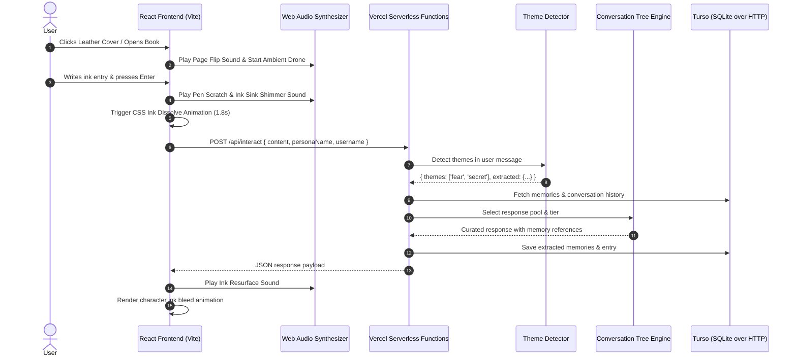

# Inkbound: Technical Implementation Documentation

This document provides a comprehensive technical breakdown of how **Inkbound** was designed, architected, and implemented.

---

## Table of Contents

1. [Architectural Overview](#1-architectural-overview)
2. [Frontend Implementation](#2-frontend-implementation)
   - [Component Structure](#component-structure)
   - [State & Interaction Lifecycle](#state--interaction-lifecycle)
   - [Ink Bleed & Animation Engine](#ink-bleed--animation-engine)
   - [Procedural Web Audio Engine](#procedural-web-audio-engine)
   - [Design System & CSS Styling](#design-system--css-styling)
3. [Backend Implementation](#3-backend-implementation)
   - [Vercel Serverless Functions](#vercel-serverless-functions)
   - [Branching Conversation Trees](#branching-conversation-trees)
   - [Theme Detection System](#theme-detection-system)
   - [Turso Database Layer](#turso-database-layer)
4. [API Specifications](#4-api-specifications)
5. [Database Schema & Data Models](#5-database-schema--data-models)
6. [Development & Build Setup](#6-development--build-setup)

---

## 1. Architectural Overview

Inkbound is built as a serverless application deployed on Vercel with Turso (hosted SQLite) as the database. The frontend renders an interactive 3D leather journal, while the backend uses branching conversation trees to generate diary responses without any external AI API calls.



---

## 2. Frontend Implementation

The frontend is implemented using **React 19** and **Vite**, structured into modular components.

### Component Structure

- **App.jsx**: Root component managing top-level state: book open/closed state, entries log, memories bank, modal visibility, and backend fetch/sync lifecycle handlers.
- **BookCover.jsx**: Renders the closed leather-bound book cover featuring embossed typography, gold corner plates, center glowing crest, and interactive unlatching book clasp button.
- **ParchmentSpread.jsx**: The main interactive two-page spread with left page (memory ledger) and right page (writing/response view).
- **TomRiddleWriter.jsx**: Typewriter component that renders text character-by-character with staggered CSS ink bleed animations.
- **MemoryModal.jsx**: Overlay modal visualizing the extracted user memory bank.
- **LoginPage.jsx**: User login/registration page.
- **audio.js**: Custom Web Audio API procedural sound engine.

### State & Interaction Lifecycle

When the user enters text on the parchment and triggers "Sink Ink into Paper":
1. CSS class `.ink-sinking` is applied, triggering blur, scale reduction, and opacity fade over `1.8s`.
2. `diaryAudio.playInkSink()` triggers a pitch-dropping sine oscillator sweep.
3. After animation completes, `onInteract(currentMessage)` fires an HTTP request to `/api/interact`.
4. Upon receiving the response, `TomRiddleWriter` reveals the ink response character by character.

### Design System & CSS Styling

- **Typography**: Self-hosted fonts via `@font-face` with `font-display: swap`
  - Title: Cinzel Decorative (Bold)
  - Body: IM Fell English (Regular + Italic)
  - Ink: Marck Script
  - UI: Playfair Display
- **Accessibility**: Supports `prefers-reduced-motion` and `prefers-reduced-transparency`
- **Viewport**: Uses `dvh` units for mobile Safari stability

---

## 3. Backend Implementation

### Vercel Serverless Functions

The backend runs as Vercel serverless functions under the `api/` directory:

```
api/
├── _lib/
│   ├── db.js              # Turso client + database operations
│   ├── diary.js           # Main interaction logic
│   ├── themes.js          # Theme detection (12 themes)
│   ├── responses.js       # ~250 curated responses
│   ├── brancher.js        # Branch selection logic
│   └── picker.js          # Response picking + personalization
├── interact.js            # POST /api/interact
├── entries.js             # GET /api/entries
├── memories.js            # GET /api/memories
└── reset.js               # POST /api/reset
```

### Branching Conversation Trees

Instead of an AI API, Inkbound uses pre-written response trees. Each response is curated in a formal 1940s British style.

**Response Flow:**
1. User writes on parchment
2. Theme detector scans input for keywords
3. Branch selector determines response tier (1st, 2nd, 3rd+ time)
4. Response picker selects from curated pool and personalizes with memories

### Theme Detection System

12 themes are detected via keyword matching:

| Theme | Keywords | Memory Extracted |
|---|---|---|
| `name_intro` | "my name is", "i am", "call me" | User's name |
| `identity_question` | "who are you", "what is this" | None |
| `fear` | "afraid", "scared", "terrified" | Fear description |
| `love` | "love", "adore", "passion" | Love interest |
| `secret` | "secret", "confession" | Secret text |
| `anger` | "angry", "furious", "rage" | Anger source |
| `sadness` | "sad", "lonely", "grief" | Sadness cause |
| `hope` | "hope", "dream", "wish" | Dream/goal |
| `magic` | "magic", "enchanted" | Magic interest |
| `daily_life` | "today", "work", "morning" | Daily context |
| `relationship` | "friend", "family" | Person mentioned |
| `generic` | anything else | None |

### Turso Database Layer

Replaces the previous SQLite/JSON dual-tier system with Turso (hosted SQLite over HTTP):

```javascript
import { connect } from "@tursodatabase/serverless";

const conn = connect({
  url: process.env.TURSO_DATABASE_URL,
  authToken: process.env.TURSO_AUTH_TOKEN,
});

// All database operations are now async
await conn.execute({
  sql: 'SELECT * FROM entries WHERE username = ?',
  args: [username]
});
```

**Key changes from previous implementation:**
- Removed `better-sqlite3` (native binary)
- Removed JSON file fallback
- All operations are now async
- Database persists across serverless invocations

---

## 4. API Specifications

### POST /api/interact

**Request:**
```json
{
  "content": "string (required)",
  "personaName": "string (optional, default: 'Tom Riddle')",
  "username": "string (optional, default: 'anonymous')"
}
```

**Response:**
```json
{
  "should_reply": true,
  "response_text": "Hello, {name}. I am {personaName}...",
  "extracted_memories": [
    {
      "category": "Identity",
      "key": "User Name",
      "value": "Alice",
      "importance": 5
    }
  ]
}
```

### GET /api/entries?username=someuser

**Response:**
```json
[
  {
    "id": 1,
    "username": "someuser",
    "content": "I had a dark dream last night",
    "response": "Tell me more about this dream...",
    "mood": "neutral",
    "created_at": "2026-08-18T12:00:00.000Z"
  }
]
```

### GET /api/memories?username=someuser

**Response:**
```json
[
  {
    "id": 1,
    "username": "someuser",
    "category": "Identity",
    "key": "User Name",
    "value": "Alice",
    "importance": 5,
    "last_seen": "2026-08-18T12:00:00.000Z"
  }
]
```

### POST /api/reset

**Request:**
```json
{
  "username": "someuser"  // optional, clears all if omitted
}
```

**Response:**
```json
{
  "success": true,
  "message": "Diary memory cleared"
}
```

---

## 5. Database Schema & Data Models

### Tables

```sql
CREATE TABLE IF NOT EXISTS entries (
  id INTEGER PRIMARY KEY AUTOINCREMENT,
  username TEXT NOT NULL DEFAULT 'anonymous',
  content TEXT NOT NULL,
  response TEXT,
  mood TEXT,
  created_at DATETIME DEFAULT CURRENT_TIMESTAMP
);

CREATE TABLE IF NOT EXISTS memories (
  id INTEGER PRIMARY KEY AUTOINCREMENT,
  username TEXT NOT NULL DEFAULT 'anonymous',
  category TEXT NOT NULL,
  key TEXT NOT NULL,
  value TEXT NOT NULL,
  importance INTEGER DEFAULT 3,
  last_seen DATETIME DEFAULT CURRENT_TIMESTAMP
);

CREATE TABLE IF NOT EXISTS conversation (
  id INTEGER PRIMARY KEY AUTOINCREMENT,
  username TEXT NOT NULL DEFAULT 'anonymous',
  role TEXT NOT NULL,
  content TEXT NOT NULL,
  created_at DATETIME DEFAULT CURRENT_TIMESTAMP
);
```

### Memory Categories

| Category | Purpose |
|---|---|
| Identity | User's name, self-identification |
| Secret | Confessions, private admissions |
| Fear | Fears, anxieties, things the user is afraid of |
| Desire | Wants, goals, passions, love interests |
| Relationship | Connections to others, friends, family |
| Fact | General information, daily life details |
| Persona | System-owned metadata (protected from deletion) |

---

## 6. Development & Build Setup

### Directory Structure

```
inkbound/
├── api/                          # Vercel serverless functions
│   ├── _lib/                     # Shared utilities
│   │   ├── db.js                 # Turso client
│   │   ├── diary.js              # Main interaction logic
│   │   ├── themes.js             # Theme detection
│   │   ├── responses.js          # Curated responses
│   │   ├── brancher.js           # Branch selection
│   │   └── picker.js             # Response picking
│   ├── interact.js               # POST /api/interact
│   ├── entries.js                # GET /api/entries
│   ├── memories.js               # GET /api/memories
│   └── reset.js                  # POST /api/reset
├── public/
│   └── fonts/                    # Self-hosted web fonts
├── scripts/
│   └── setup-db.js               # Turso schema initialization
├── src/                          # React frontend (unchanged)
├── schema.sql                    # Database schema
├── vercel.json                   # Vercel configuration
├── package.json                  # Dependencies
└── vite.config.js                # Vite configuration
```

### Environment Variables

```env
TURSO_DATABASE_URL=libsql://your-db.turso.io
TURSO_AUTH_TOKEN=your-token-here
```

### Available Scripts

| Command | Description |
|---|---|
| `npm run dev` | Starts Vite frontend dev server |
| `npm run build` | Bundles frontend for production |
| `npm run lint` | Runs oxlint for code quality |
| `node scripts/setup-db.js` | Initializes Turso schema |

### Running Lint & Build Checks

```bash
# Run Oxlint
npm run lint

# Create Vite production bundle
npm run build
```

---

*Inkbound documentation maintained by the DeepMind Agentic Coding team.*
