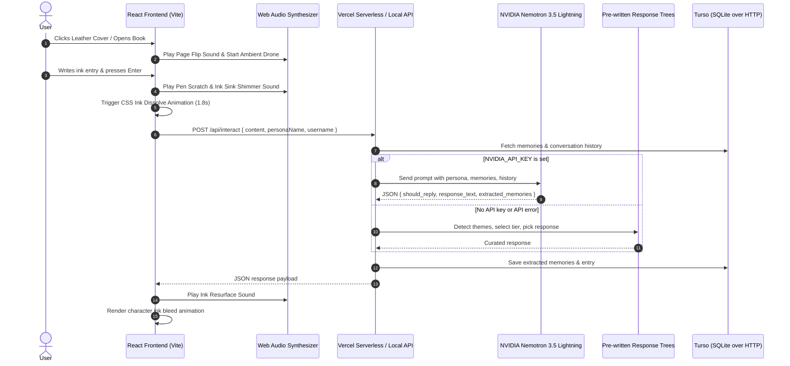

# Inkbound: Technical Implementation Documentation

This document provides a comprehensive technical breakdown of how **Inkbound** was designed, architected, and implemented.

---

## Table of Contents

1. [Architectural Overview](#1-architectural-overview)
2. [Frontend Implementation](#2-frontend-implementation)
   - [Component Structure](#component-structure)
   - [State & Interaction Lifecycle](#state--interaction-lifecycle)
   - [Ink Bleed & Animation Engine](#ink-bleed--animation-engine)
   - [Procedural Web Audio Engine](#procedural-web-audio-engine)
   - [Design System & CSS Styling](#design-system--css-styling)
3. [Backend Implementation](#3-backend-implementation)
   - [Vercel Serverless Functions](#vercel-serverless-functions)
   - [Local Development Server](#local-development-server)
   - [Branching Conversation Trees](#branching-conversation-trees)
   - [Theme Detection System](#theme-detection-system)
   - [Turso Database Layer](#turso-database-layer)
4. [API Specifications](#4-api-specifications)
5. [Database Schema & Data Models](#5-database-schema--data-models)
6. [Development & Build Setup](#6-development--build-setup)

---

## 1. Architectural Overview

Inkbound is built as a serverless application deployed on Vercel with Turso (hosted SQLite) as the database. The frontend renders an interactive 3D leather journal. The backend uses **NVIDIA Nemotron 3.5 Lightning** (via the NIM API) as the primary intelligence, with a pre-written branching conversation tree system as fallback when no API key is set.



---

## 2. Frontend Implementation

The frontend is implemented using **React 19** and **Vite**, structured into modular components.

### Component Structure

- **App.jsx**: Root component managing top-level state: book open/closed state, entries log, memories bank, modal visibility, and backend fetch/sync lifecycle handlers.
- **BookCover.jsx**: Renders the closed leather-bound book cover featuring embossed typography, gold corner plates, center glowing crest, and interactive unlatching book clasp button.
- **ParchmentSpread.jsx**: The main interactive two-page spread with left page (memory ledger with pagination) and right page (writing/response view).
- **TomRiddleWriter.jsx**: Typewriter component that renders text character-by-character with staggered CSS ink bleed animations.
- **MemoryModal.jsx**: Overlay modal visualizing the extracted user memory bank.
- **LoginPage.jsx**: User login/registration page.
- **audio.js**: Custom Web Audio API procedural sound engine.

### State & Interaction Lifecycle

When the user enters text on the parchment and triggers "Sink Ink into Paper":
1. CSS class `.ink-sinking` is applied, triggering blur, scale reduction, and opacity fade over `1.8s`.
2. `diaryAudio.playInkSink()` triggers a pitch-dropping sine oscillator sweep.
3. After animation completes, `onInteract(currentMessage)` fires an HTTP request to `/api/interact`.
4. Upon receiving the response, `TomRiddleWriter` reveals the ink response character by character.

### Design System & CSS Styling

- **Typography**: Self-hosted fonts via `@font-face` with `font-display: swap`
  - Title: Cinzel Decorative (Bold)
  - Body: IM Fell English (Regular + Italic)
  - Ink: Marck Script
  - UI: Playfair Display
- **Accessibility**: Supports `prefers-reduced-motion` and `prefers-reduced-transparency`
- **Viewport**: Uses `dvh` units for mobile Safari stability

---

## 3. Backend Implementation

### Vercel Serverless Functions

The production backend runs as Vercel serverless functions under the `api/` directory:

```
api/
├── _lib/
│   ├── db.js              # Turso client + database operations
│   ├── diary.js           # Main interaction logic (routes to AI or fallback)
│   ├── nemotron.js        # NVIDIA Nemotron API client
│   ├── themes.js          # Theme detection (12 themes, fallback system)
│   ├── responses.js       # ~250 curated responses (fallback system)
│   ├── brancher.js        # Branch selection logic (fallback system)
│   └── picker.js          # Response picking + personalization (fallback system)
├── interact.js            # POST /api/interact
├── entries.js             # GET /api/entries
├── memories.js            # GET /api/memories
└── reset.js               # POST /api/reset
```

### Nemotron AI Integration

The primary intelligence uses NVIDIA Nemotron 3.5 Lightning via the NIM API (OpenAI-compatible endpoint).

**API endpoint:** `https://integrate.api.nvidia.com/v1/chat/completions`
**Model:** `nvidia/nemotron-3.5-lightning-30b-a3b`

The integration works by:
1. Building a system prompt with the Tom Riddle persona (1940s British tone)
2. Injecting extracted memories as context (`• [Category] Key: Value`)
3. Including the last 8 conversation messages for continuity
4. Sending to Nemotron with `response_format: { type: 'json_object' }`
5. Parsing the JSON response for `should_reply`, `response_text`, and `extracted_memories`

**Personality prompt highlights:**
- "Polite, articulate, charming, curious, and quietly intense"
- "Speak in formal, elegant 1940s British English"
- "Deeply interested in the user's secrets, fears, desires, names, rivals"
- "NEVER use modern slang, tech jargon, or AI disclaimers"

### Local Development Server

For local development, `server-dev.js` provides the same API handlers without deploying to Vercel:

```
npm run dev
```

This starts two processes via `concurrently`:
1. **Local API server** (`server-dev.js` on port 3001)
2. **Vite dev server** (port 5173) with proxy to port 3001

The Vite proxy is configured in `vite.config.js`:
```javascript
server: {
  proxy: {
    '/api': {
      target: 'http://localhost:3001',
      changeOrigin: true,
    }
  }
}
```

A `.env` file in the project root provides Turso credentials for local development (gitignored).

### Branching Conversation Trees

Instead of an AI API, Inkbound uses pre-written response trees. Each response is curated in a formal 1940s British style.

**Response Flow:**
1. User writes on parchment
2. Theme detector scans input for keywords/patterns
3. History is fetched BEFORE adding the current message (so tier 1 works for first messages)
4. Branch selector determines response tier (1st, 2nd, 3rd+ time)
5. Response picker selects from curated pool and personalizes with `{name}` and `{personaName}` placeholders

### Theme Detection System

12 themes are detected. Name introduction uses regex patterns (not keywords) to avoid false positives like "I am afraid" triggering name_intro.

**Name Detection (regex-based):**
```javascript
const namePatterns = [
  /my name is\s+[a-z]/i,
  /\bi am\s+[a-z]/i,
  /\bcall me\s+[a-z]/i,
  /\bi'm\s+[a-z]/i,
  /\bi am called\s+[a-z]/i,
  /\bthey call me\s+[a-z]/i
];
```

A common words filter prevents false extractions (e.g., "I am afraid" does not extract "afraid" as a name).

**Theme Table:**

| Theme | Detection | Memory Extracted |
|---|---|---|
| `name_intro` | Regex patterns (see above) | User's name (capitalized) |
| `identity_question` | "who are you", "what is your name", "do you have a name", "tell me about yourself", "introduce yourself" | None |
| `fear` | "afraid", "scared", "terrified", "dread", "nightmare" | Fear description |
| `love` | "love", "adore", "passion", "beloved" | Love interest |
| `secret` | "secret", "confession", "don't tell", "hidden" | Secret text |
| `anger` | "angry", "furious", "hate", "rage", "bitter" | Anger source |
| `sadness` | "sad", "lonely", "grief", "sorrow", "weep" | Sadness cause |
| `hope` | "hope", "dream", "wish", "aspire", "someday" | Dream/goal |
| `magic` | "magic", "enchanted", "supernatural", "spell", "curse" | Magic interest |
| `daily_life` | "today", "work", "morning", "routine", "commute" | Daily context |
| `relationship` | "friend", "family", "mother", "colleague" | Person mentioned |
| `generic` | anything else | None |

### Turso Database Layer

Uses `@tursodatabase/serverless` with lazy connection initialization:

```javascript
import { connect } from "@tursodatabase/serverless";

let conn;
function getConn() {
  if (!conn) {
    conn = connect({
      url: process.env.TURSO_DATABASE_URL,
      authToken: process.env.TURSO_AUTH_TOKEN,
    });
  }
  return conn;
}
```

**Key API pattern** — args go as the second argument to `session.execute()`:
```javascript
const result = await getConn().session.execute(
  'SELECT * FROM entries WHERE username = ?',
  [username]
);
```

**Row format** — Turso returns rows as arrays. A `toObjects()` helper converts them to named objects:
```javascript
function toObjects(result) {
  const cols = result.columns;
  return result.rows.map(row => {
    const obj = {};
    cols.forEach((col, i) => { obj[col] = row[i]; });
    return obj;
  });
}
```

---

## 4. API Specifications

### POST /api/interact

**Request:**
```json
{
  "content": "string (required)",
  "personaName": "string (optional, default: 'Tom Riddle')",
  "username": "string (optional, default: 'anonymous')"
}
```

**Response:**
```json
{
  "should_reply": true,
  "response_text": "I am Tom Riddle. I listen. I remember. I write back.",
  "extracted_memories": [
    {
      "category": "Identity",
      "key": "User Name",
      "value": "Alice",
      "importance": 5
    }
  ]
}
```

### GET /api/entries?username=someuser

**Response:**
```json
[
  {
    "id": 1,
    "username": "someuser",
    "content": "I had a dark dream last night",
    "response": "Tell me more about this dream...",
    "mood": "neutral",
    "created_at": "2026-08-18 12:00:00"
  }
]
```

### GET /api/memories?username=someuser

**Response:**
```json
[
  {
    "id": 1,
    "username": "someuser",
    "category": "Identity",
    "key": "User Name",
    "value": "Alice",
    "importance": 5,
    "last_seen": "2026-08-18 12:00:00"
  }
]
```

### POST /api/reset

**Request:**
```json
{
  "username": "someuser"  // optional, clears all if omitted
}
```

**Response:**
```json
{
  "success": true,
  "message": "Diary memory cleared"
}
```

---

## 5. Database Schema & Data Models

### Tables

```sql
CREATE TABLE IF NOT EXISTS entries (
  id INTEGER PRIMARY KEY AUTOINCREMENT,
  username TEXT NOT NULL DEFAULT 'anonymous',
  content TEXT NOT NULL,
  response TEXT,
  mood TEXT,
  created_at DATETIME DEFAULT CURRENT_TIMESTAMP
);

CREATE TABLE IF NOT EXISTS memories (
  id INTEGER PRIMARY KEY AUTOINCREMENT,
  username TEXT NOT NULL DEFAULT 'anonymous',
  category TEXT NOT NULL,
  key TEXT NOT NULL,
  value TEXT NOT NULL,
  importance INTEGER DEFAULT 3,
  last_seen DATETIME DEFAULT CURRENT_TIMESTAMP
);

CREATE TABLE IF NOT EXISTS conversation (
  id INTEGER PRIMARY KEY AUTOINCREMENT,
  username TEXT NOT NULL DEFAULT 'anonymous',
  role TEXT NOT NULL,
  content TEXT NOT NULL,
  created_at DATETIME DEFAULT CURRENT_TIMESTAMP
);
```

### Memory Categories

| Category | Purpose |
|---|---|
| Identity | User's name, self-identification |
| Secret | Confessions, private admissions |
| Fear | Fears, anxieties, things the user is afraid of |
| Desire | Wants, goals, passions, love interests |
| Relationship | Connections to others, friends, family |
| Fact | General information, daily life details |
| Persona | System-owned metadata (protected from deletion) |

---

## 6. Development & Build Setup

### Directory Structure

```
inkbound/
├── api/                          # Vercel serverless functions
│   ├── _lib/                     # Shared utilities
│   │   ├── db.js                 # Turso client (lazy connection)
│   │   ├── diary.js              # Main interaction logic (routes AI or fallback)
│   │   ├── nemotron.js           # NVIDIA Nemotron API client
│   │   ├── themes.js             # Theme detection (regex + keywords, fallback)
│   │   ├── responses.js          # ~250 curated responses (fallback)
│   │   ├── brancher.js           # Branch/tier selection (fallback)
│   │   └── picker.js             # Response picking + personalization (fallback)
│   ├── interact.js               # POST /api/interact
│   ├── entries.js                # GET /api/entries
│   ├── memories.js               # GET /api/memories
│   └── reset.js                  # POST /api/reset
├── public/
│   └── fonts/                    # Self-hosted web fonts
├── scripts/
│   └── setup-db.js               # Turso schema initialization
├── src/                          # React frontend
│   ├── App.jsx                   # Root component (API_BASE = '/api')
│   ├── components/               # UI components
│   └── utils/audio.js            # Web Audio synthesizer
├── server-dev.js                 # Local API dev server (port 3001)
├── schema.sql                    # Database schema
├── vercel.json                   # Vercel configuration
├── .env                          # Local credentials (gitignored)
├── .env.example                  # Example env file
├── package.json                  # Dependencies
└── vite.config.js                # Vite config with API proxy
```

### Environment Variables

```env
TURSO_DATABASE_URL=libsql://your-db.turso.io
TURSO_AUTH_TOKEN=your-turso-token
NVIDIA_API_KEY=nvapi-your-nvidia-key
```

### Available Scripts

| Command | Description |
|---|---|
| `npm run dev` | Starts local API server (port 3001) + Vite (port 5173) concurrently |
| `npm run build` | Bundles frontend for production |
| `npm run lint` | Runs oxlint for code quality |
| `node scripts/setup-db.js` | Initializes Turso schema |

### Running Lint & Build Checks

```bash
# Run Oxlint
npm run lint

# Create Vite production bundle
npm run build
```

---

*Inkbound documentation maintained by the DeepMind Agentic Coding team.*
